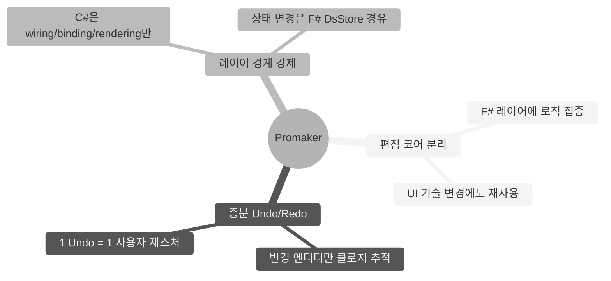
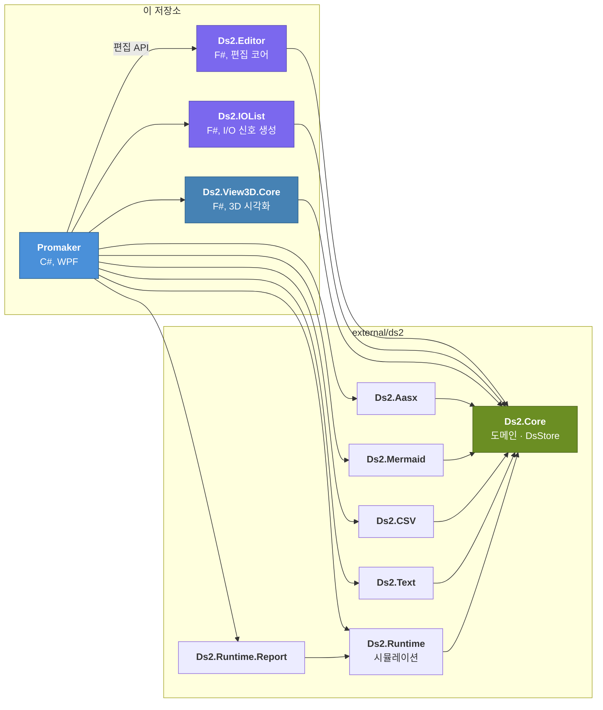
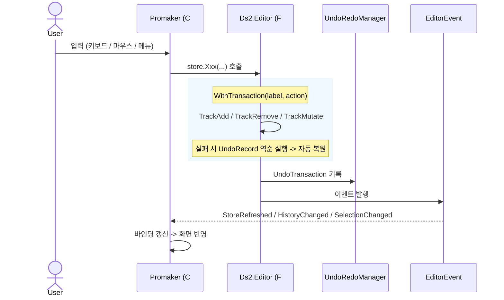

<div align="center">

# Promaker — DS2 시퀀스 제어 모델 편집기

[](https://dotnet.microsoft.com/)
[](https://fsharp.org/)
[](https://learn.microsoft.com/dotnet/csharp/)
[](LICENSE)

---

[설계 원칙](#핵심-설계-원칙) · [아키텍처](#아키텍처) · [구성](#저장소-구성) · [빌드](#빌드-및-실행) · [인스톨러](#인스톨러)

</div>

설비 시퀀스 제어 모델(`.sdf` JSON, AASX)을 그리고, 장치·조건·태그를 붙이고, 시뮬레이션으로 돌려 보는 Windows 데스크톱 앱이다. 네트워크·현장 연동 없이 **로컬 파일만으로 동작**한다. 실 PLC 모니터링·OPC UA 는 `ds2-Hub` / `ds2-Pilot` 의 몫이다.

도메인 모델·변환기·시뮬레이션 엔진은 [`ds2`](https://github.com/DualsoftDev/ds2) 라이브러리를 `external/ds2` 서브모듈로 가져다 쓴다.

## 핵심 설계 원칙



---

## 아키텍처



- C#(Promaker)은 wiring · binding · rendering 만 한다. 모델 상태 변경은 `Ds2.Editor` 의 `DsStore` 확장 메서드를 거친다.
- `Ds2.Editor` 가 트랜잭션(`WithTransaction`) · Undo/Redo · 복사/붙여넣기 · 캐스케이드 삭제 · 투영(Tree/Canvas)을 담당한다.
- 라이브러리 쪽(`Ds2.Core` 이하)은 편집기를 모른다.

### 편집 흐름



> **제약**: `store.GetProject(id).Name <- "new"` 같은 직접 필드 수정은 Undo 추적 불가. 변경은 반드시 `store.메서드()` 경유.
> 상세: ds2 저장소의 [`RUNTIME.md`](https://github.com/DualsoftDev/ds2/blob/main/RUNTIME.md)

---

## 저장소 구성

```
Apps/Promaker/
  Promaker/                 WPF 앱 (C#)
    Controls/               Canvas · PropertyPanel · Shell(툴바·탐색기) · Simulation(간트) · ExpressionEditor · Logging
    Dialogs/                CallCreate · ApiCall · Condition · TagWizard · DurationBatch · ImportExport · Plc · Settings · View3D …
    ViewModels/             Shell(MainViewModel 분할) · PropertyPanel · Simulation · NodeCommands · Logging
    Dock/                   AvalonDock 레이아웃 캡슐화
    Services/ Themes/ Resources/ Assets/ Help/ Presentation/ wwwroot/
  Promaker.sln              이 저장소의 빌드 진입점
  Installer/                Inno Setup 스크립트(Setup.iss · CodeDependencies.iss)
  Makefile · scripts/       publish → ISCC → 배포(dist-common.mk · bump-buildversion.sh …)
  BuildVersion.txt          Promaker 버전 SSOT (Directory.Build.props 가 csproj 에 주입)
  ReleaseNote.txt           릴리스 노트 누적
  Docs/                     설계·완료 기록
  LOCALIZATION_GUIDE.md     다국어 리소스 안내
Solutions/
  Core/Ds2.Editor           편집 코어 (F#) — 트랜잭션 · Undo/Redo · 붙여넣기 · 투영 · 쿼리
  Convert/Ds2.IOList        I/O 신호 생성·매칭 · CSV/Excel 내보내기
  View/Ds2.View3D           3D 시각화 엔진(Core) + 로봇 모델(wwwroot/models) + 테스트
  Tools/Ds2.TutorialVerification   학습 모델 100개 검증 실행기(고정 픽스처 포함)
  Tests/                    Ds2.Store.Editor.Tests · Ds2.Integration.Tests · Promaker.Tests
ExternalDlls/               AAStoPLC(래더 편집) · Ev2.PLC.Common.FS · Dual.Common.Base.FS — Promaker 가 쓰는 바이너리 스냅샷
external/ds2                DS2 라이브러리 서브모듈
```

---

## 빌드 및 실행

```bash
git clone --recurse-submodules https://github.com/DualsoftDev/ds2-Promaker.git
cd ds2-Promaker
dotnet build Apps/Promaker/Promaker.sln -nologo
dotnet test  Apps/Promaker/Promaker.sln -nologo
```

이미 받은 뒤 서브모듈이 비어 있으면 `git submodule update --init --recursive`.

```bash
make -C Apps/Promaker run            # Debug 빌드 후 실행
make -C Apps/Promaker build-release
```

| 테스트 프로젝트 | 범위 |
|:--|:--|
| `Ds2.Store.Editor.Tests` | DsStore 편집 CRUD · Undo/Redo · 캐스케이드 · 복사/붙여넣기 · 패널 · 투영 · Editor 로 만든 모델의 시뮬레이션 |
| `Ds2.Integration.Tests` | AASX/Mermaid 라운드트립 · Device 분리 저장 |
| `Promaker.Tests` | ViewModel · 시뮬레이션 패널 · 탐색기 검색 |
| `Ds2.View3D.Tests` | ContextBuilder · LayoutEngine · SceneBuilder |

## 인스톨러

Inno Setup 6 이 필요하다.

```bash
make -C Apps/Promaker dist-installer            # self-contained (기본 MODE=sc)
make -C Apps/Promaker dist-installer MODE=fd    # framework-dependent (.NET Desktop Runtime 자동 다운로드)
```

산출물: `Apps/Promaker/Installer/Output/Promaker_Setup_<버전>_sc.exe` (`_fd`). 버전은 `BuildVersion.txt` 하나만 올린다(`scripts/bump-buildversion.sh`). 정식 배포(릴리스 노트 누적 · 태그 · scp)는 `Apps/Promaker/.claude/skills/dist` 워크플로를 쓴다.

## 로깅

log4net. `App.xaml.cs OnStartup` 에서 `log4net.config` 를 읽는다(없으면 로깅 없이 실행). 로그는 `<실행 파일 위치>/logs/ds2_yyyyMMdd.log`, 날짜+크기 롤링(10MB × 10).

| 지점 | 레벨 |
|:--|:--:|
| 앱 시작/종료, 파일 열기/저장 완료 | `INFO` |
| 전역 미처리 예외 | `FATAL` |
| 트랜잭션 실패, Undo/Redo 실패, 이벤트 구독자 에러 | `ERROR` |
| 트랜잭션 · Undo/Redo 성공 | `DEBUG` |

## 관련 문서

| 문서 | 내용 |
|:-----|:-----|
| [`RUNTIME.md` (ds2)](https://github.com/DualsoftDev/ds2/blob/main/RUNTIME.md) | 편집 명령 · CRUD · Undo/Redo · 복사/붙여넣기 · JSON · AASX 동작 상세 |
| [`Apps/Promaker/Docs/`](Apps/Promaker/Docs/) | 설계·완료 기록 |
| [`Apps/Promaker/LOCALIZATION_GUIDE.md`](Apps/Promaker/LOCALIZATION_GUIDE.md) | 다국어 리소스 |
| [`Solutions/Tools/Ds2.TutorialVerification/README.md`](Solutions/Tools/Ds2.TutorialVerification/README.md) | 학습 모델 검증 실행기 |

## License and Notices

이 저장소는 **Apache License 2.0** 이다 — [`LICENSE`](LICENSE) · [`NOTICE`](NOTICE). `ExternalDlls/` 의 DLL 은 Dualsoft 가 별도 저장소에서 빌드해 넣는 바이너리 스냅샷이며 소스는 이 저장소에 없다.
